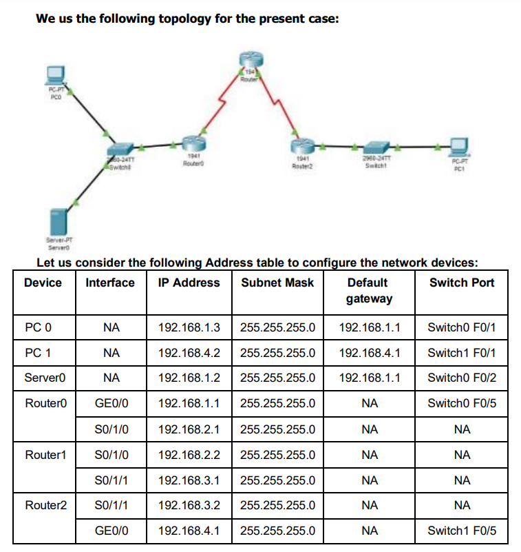
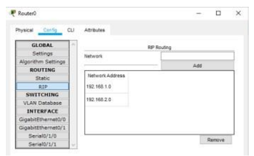
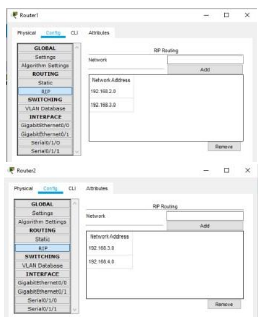

# PRACTICAL NO 5: Configure IOS Intrusion Prevention System (IPS) Using the CIL(Practical_6)
[Practical_File_All_In_One_from_part1_to_part2](Configure%20IOS%20Intrusion%20Prevention%20System%20(IPS)%20Using%20the%20CIL_Final.pkt)


1



## Part 1: Static Routing
[Practical_File_1](Configure%20IOS%20Intrusion%20Prevention%20System%20(IPS)%20Using%20the%20CIL_Part_1.pkt)
---

We need to set the Routing table in all the Routers so that each node could
send and receive packets from others (RIP is set in all the Routers as
follows)




Now we can check the connectivity by sending ping commands from any node
to any other node

## PART1: Enable the IOS IPS (on Router1)
[Practical_File_2](Configure%20IOS%20Intrusion%20Prevention%20System%20(IPS)%20Using%20the%20CIL_Part_1.pkt)

Type the following commands in the `CLI mode` of `Router1`

```bash
Router#show version
Router#configure terminal
Router(config)#license boot module c1900 technology-package securityk9
ACCEPT? [yes/no]: y
Press enter key
System configuration has been modified. Save? [yes/no]:y
Proceed with reload? [confirm] Press Enter key
Press RETURN to get started! Press Enter key
Router>enable
Router# Router#show version
```
As seen above now the security package has been enabled
Now type the following commands in the CLI mode of Router1

```bash
Router#
Router#clock set 10:30:45 march 3 2022
Router#mkdir smile
Create directory filename [smile]? Press enter key
Created dir flash:smile
Router#
Router#configure terminal
Router(config)#ip ips config location flash:smile
Router(config)#ip ips name iosips
Router(config)#ip ips notify log
Router(config)#ip ips signature-category
Router(config-ips-category)#category all
Router(config-ips-category-action)#retired true
Router(config-ips-category-action)#exit
Router(config-ips-category)#category ios_ips basic
Router(config-ips-category-action)#retired false
Router(config-ips-category-action)#exit
Router(config-ips-category)#exit
Do you want to accept these changes? [confirm]y
Router(config)#interface Serial0/1/0
Router(config-if)#ip ips iosips out
Router(config-if)#
Press enter key
Router(config-if)#exit
Router(config)#
```
## Part 2: Modify the Signature
[Practical_File_2](Configure%20IOS%20Intrusion%20Prevention%20System%20(IPS)%20Using%20the%20CIL_Final.pkt)

Type the following commands in the `CLI mode` of `Router1`

```bash
Router(config)#
Router(config)#ip ips signature-definition
Router(config-sigdef)#signature 2004 0
Router(config-sigdef-sig)#status
Router(config-sigdef-sig-status)#retired false
Router(config-sigdef-sig-status)#enabled true
Router(config-sigdef-sig-status)#exit
Router(config-sigdef-sig)#engine
Router(config-sigdef-sig-engine)#event-action produce-alert
Router(config-sigdef-sig-engine)#event-action deny-packet-inline
Router(config-sigdef-sig-engine)#exit
Router(config-sigdef-sig)#exit
Router(config-sigdef)#exit
Do you want to accept these changes? [confirm]y
Router(config)#
```

Now we need to verify the above IPS configuration, we do it first
by pinging `PC1 to SERVER` and then from `SERVER to PC1`
`PC1 to SERVER – The ping fails`
`Server to PC1 – The Ping is successful`

We check the Syslog service on the server to check the logging activity,
by typing the following commands in `Router0`
---
```bash
Router>enable
Router#configure terminal
Router(config)#logging 192.168.1.2
Router(config)#
Router(config)#
Router(config)#exit
Router#
Router#ping 192.168.1.2
Type escape sequence to abort.
Sending 5, 100-byte ICMP Echos to 192.168.1.2, timeout is 2 seconds:
!!!!!
Success rate is 100 percent (5/5), round-trip min/avg/max = 0/0/3 ms
Router#
```
Hence, we set the IPS and also verified it on Router1
