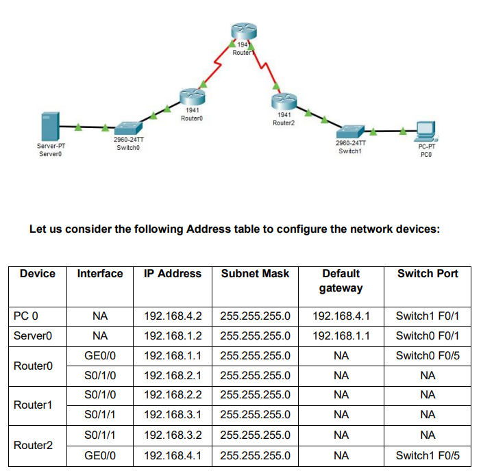

# Configure IP ACLs to Mitigate Attacks and Configuring IPv6 ACLs
[Practical_File_All_In_One_from_part1_to_part3](Practical_4(Part1_to_part3).pkt)

## Part 1 - Verify connectivity among devices before firewall configuration
[Practical_File_1](Verify_connectivity_among_devices_before_firewall_configuration(Part_1).pkt)


1



---
2

ADD is `192.168.1.0` and `192.168.2.0`

---
3

ADD is `192.168.3.0` and `192.168.4.0`
---
CMD is `ping 192.168.1.2`

---
4

CMD is `ping 192.168.4.2`

---

## Part 2 – Secure Access to Routers
[Practical_File_2](Secure_Access_to_Routers(Part_2).pkt)

Enter the following commands in CLI mode of `Router0`

```bash
Router>enable
Router#configure terminal
Router(config)#ip domain-name ismail.com
Router(config)#hostname Router0
Router0(config)#
Router0(config)#crypto key generate rsa
Router0(config)#line vty 0 4
Router0(config-line)#transport input ssh
Router0(config-line)#login local
Router0(config-line)#exit
Router0(config)#username SSHadmin privilege 15 password ismail
Router0(config)#exit
Router0#
```
Enter the following commands in CLI mode of `Router1`
```bash
Router>enable
Router#configure terminal
Router(config)#ip domain-name ismail.com
Router(config)#hostname Router1
Router1(config)#
Router1(config)#crypto key generate rsa
Router1(config)#line vty 0 4
Router1(config-line)#transport input ssh
Router1(config-line)#login local
Router1(config-line)#exit
Router1(config)#username SSHadmin privilege 15 password ismail
Router1(config)#exit
Router1#
```
Enter the following commands in CLI mode of `Router2`
```bash
Router>enable
Router#configure terminal
Router(config)#ip domain-name ismail.com
Router(config)#hostname Router2
Router2(config)#
Router2(config)#crypto key generate rsa
Router2(config)#line vty 0 4
Router2(config-line)#transport input ssh
Router2(config-line)#login local
Router2(config-line)#exit
Router2(config)#username SSHadmin privilege 15 password ismail
Router2(config)#exit
Router2#
```
Create an ACL 10 to permit remote access to PC only
Enter the following commands in CLI mode of `all Routers` 
```bash
Router>enable
Router#configure terminal
Router(config)#access-list 10 permit host 192.168.4.2
Router(config)#line vty 0 4
Router(config-line)#access-class 10 in
```
Now we `verify` the remote access from PC using the following and find it to
be successful


CMD is `ssh -l SSHadmin 192.168.4.1`

CMD is `ssh -l SSHadmin 192.168.3.1`

CMD is `ssh -l SSHadmin 192.168.1.1`

Password:`ismail`


Now we `verify the remote access` from Server using the following and find
it to be failure

CMD is `ssh -l SSHadmin 192.168.1.1`

CMD is `ssh -l SSHadmin 192.168.2.2`

CMD is `ssh -l SSHadmin 192.168.3.1`

CMD is `ssh -l SSHadmin 192.168.4.1`

## Part 3 - Create a Numbered IP ACL 120 on R1

[Practical_File_3](Create%20a%20Numbered%20IP%20ACL%20120%20on%20R1(Part_3).pkt)

Enter the following commands in the CLI mode of `Router1`

```bash
Router1>enable
Router1#
Router1#configure terminal
Router1(config)#access-list 120 permit udp any host 192.168.1.2 eq domain
Router1(config)#access-list 120 permit tcp any host 192.168.1.2 eq smtp
Router1(config)#access-list 120 permit tcp any host 192.168.1.2 eq ftp
Router1(config)#access-list 120 deny tcp any host 192.168.1.2 eq 443
Router1(config)#exit
Router1#configure terminal
Router1(config)#interface Serial0/1/1
Router1(config-if)#ip access-group 120 in
```

`Verify` the above entering the following commands in the `PC`

CMD is `ftp 192.168.1.2`
---
Username is `cisco`
---
Password is `cisco`
---


## Part 4 - Configuring IPv6 ACLs


Make sure You Use `ipv6 Configuration` in `PC 0,PC 1,Server0` and for `Routers We CLI Mode`
---

Configuring `Router0`
```bash
Router>
Router>enable
Router#
Router#configure terminal
Router(config)#ipv6 unicast-routing
Router(config)#interface GigabitEthernet0/0
Router(config-if)#ipv6 address 2002::1/64
Router(config-if)#ipv6 rip a enable
Router(config-if)#no shutdown
Router(config-if)#exit
Router(config)#
Router(config)#interface GigabitEthernet0/1
Router(config-if)#ipv6 address 2001::1/64
Router(config-if)#ipv6 rip a enable
Router(config-if)#no shutdown
Router(config-if)#exit
Router(config)#
Router(config)#interface Serial0/1/0
Router(config-if)#ipv6 address 2003::1/64
Router(config-if)#ipv6 rip a enable
Router(config-if)#no shutdown
Router(config-if)#exit
Router(config)#
```
Configuring `Router1`
```bash
Router>enable
Router#configure terminal
Router(config)#ipv6 unicast-routing
Router(config)#
Router(config)#interface Serial0/1/0
Router(config-if)#ipv6 address 2003::1/64
Router(config-if)#ipv6 rip a enable
Router(config-if)#no shutdown
Router(config-if)#
Router(config-if)#exit
Router(config)#
Router(config)#interface Serial0/1/1
Router(config-if)#ipv6 address 2004::1/64
Router(config-if)#ipv6 rip a enable
Router(config-if)#no shutdown
Router(config-if)#exit
Router(config)#
```
Configuring `Router2`
```bash
Router>enable
Router#configure terminal
Router(config)#ipv6 unicast-routing
Router(config)#
Router(config)#interface Serial0/1/1
Router(config-if)#ipv6 address 2004::2/64
Router(config-if)#ipv6 rip a enable
Router(config-if)#no shutdown
Router(config-if)#exit
Router(config)#interface GigabitEthernet0/0
Router(config-if)#ipv6 address 2005::1/64
Router(config-if)#ipv6 rip a enable
Router(config-if)#no shutdown
Router(config-if)#exit
Router(config)#
```
Check the connectivity by pinging from PCs to Server CMD is
`ping 2002::2` and `ping 2005::2`
---

We enter the following commands in the CLI mode of the `Router1` and
`Router2`, apply it at the proper interface
---
```bash
Router>
Router>enable
Router#configure terminal
Router(config)#ipv6 access-list smile
Router(config-ipv6-acl)#deny tcp any host 2005::2 eq www
Router(config-ipv6-acl)#deny tcp any host 2005::2 eq 443
Router(config-ipv6-acl)#permit ipv6 any any
Router(config-ipv6-acl)#exit
Router(config)#interface Serial0/1/1
Router(config-if)#ipv6 traffic-filter smile in
Router(config-if)#exit
Router(config)#
```
We verify the configuration by first accessing the `www service` from the
`Web browser` of both PCs and get failure Of `Request Timeout`
---
Next we verify whether the ipv6 protocol works by pinging server from any
of the PC (`it must be successful`) 
---

CMD is `ping 2005::2`
---