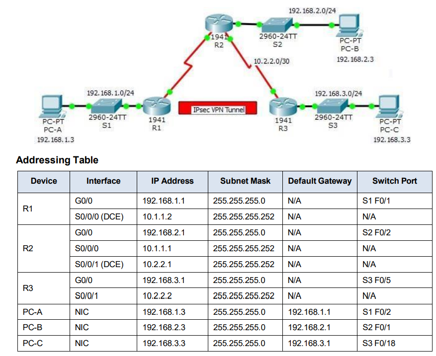

# PRACTICAL - 9 Packet Tracer - Configure and Verify a Site-to-Site IPsec VPN using CLI

[Practical_File_Final](Configure%20and%20Verify%20a%20Site-to-Site%20IPsec%20VPN%20Using%20CLI.pkt)

1



## Part 1: Configure IPsec Parameters on R1(config)

Step 1: Test connectivity

`Ping from PC-A to PC-C`

Type the following command in `CLI mode` of `R1(config)`,

```bash
R1>en
R1#configure terminal
R1(config)#enable secret enpa55
R1(config)#line console 0
R1(config)#password conpa55
R1(config)#login
R1(config)#exit
R1(config)#ip domain-name ccnasecurtiy.com
R1(config)#username admin secret adminpa55
R1(config)#line vty 0 4
R1(config)#exit
R1(config)#crypto key generate rsa
R1(config)#1024
```
Type the following command in `CLI mode` of `R2(config)`,

```bash
R2>en
R2#configure terminal
R2(config)#enable secret enpa55
R2(config)#line console 0
R2(config)#password conpa55
R2(config)#login
R2(config)#exit
R2(config)#ip domain-name ccnasecurtiy.com
R2(config)#username admin secret adminpa55
R2(config)#line vty 0 4
R2(config)#exit
R2(config)#crypto key generate rsa
R2(config)#1024
```
Type the following command in `CLI mode` of `R3(config)`,

```bash
R3>en
R3#configure terminal
R3(config)#enable secret enpa55
R3(config)#line console 0
R3(config)#password conpa55
R3(config)#login
R3(config)#exit
R3(config)#ip domain-name ccnasecurtiy.com
R3(config)#username admin secret adminpa55
R3(config)#line vty 0 4
R3(config)#exit
R3(config)#crypto key generate rsa
R3(config)#1024
```

In `CLI mode of R1` type following 
```bash
en
conf t
router ospf 1
network 192.168.1.0 0.0.0.255 area 0
network 10.1.1.0 0.0.0.3 area 0
```
In `CLI mode of R2` type following 
```bash
en
conf t
router ospf 1
network 192.168.2.0 0.0.0.255 area 0
network 10.2.2.0 0.0.0.3 area 0
network 10.1.1.0 0.0.0.3 area 0
ex
```
In `CLI mode of R3` type following 
```bash
en
conf t
router ospf 1
network 10.2.2.0 0.0.0.3 area 0
network 192.168.3.0 0.0.0.255 area 0
ex
```
Step 2: Enable the Security Technology package.

In `CLI mode of R1` type following 

```bash
R1>en
R1#conf t
R1(config)# license boot module c1900 technology-package securityk9
ACCEPT? [YES/NO]: y
R1(config)#en
R1#reload
User Access Verification
Password:conpa55
R1>en
Password:enpa55
R1#show version
R1#conf t
```
```bash
R1(config)# ...
access-list 110 permit ip 192.168.1.0 0.0.0.255 192.168.3.0 0.0.0.255
crypto isakmp policy 10
encryption aes 256
authentication pre-share
group 5
exit
crypto isakmp key vpnpa55 address 10.2.2.2
crypto ipsec transform-set VPN-SET esp-aes esp-sha-hmac
crypto map VPN-MAP 10 ipsec-isakmp
description VPN connection to R3
set peer 10.2.2.2
set transform-set VPN-SET
match address 110
exit
interface se0/0/0
crypto map VPN-MAP
```
In `CLI mode of R3` type following 

```bash
R1>en
R1#conf t
R1(config)# license boot module c1900 technology-package securityk9
ACCEPT? [YES/NO]: y
R1(config)#en
R1#reload
User Access Verification
Password:conpa55
R1>en
Password:enpa55
R1#show version
R1#conf t
```
```bash
R1(config)# ...
access-list 110 permit ip 192.168.3.0 0.0.0.255 192.168.1.0 0.0.0.255
crypto isakmp policy 10
encryption aes 256
authentication pre-share
group 5
exit
crypto isakmp key vpnpa55 address 10.1.1.2
crypto ipsec transform-set VPN-SET esp-aes esp-sha-hmac
crypto map VPN-MAP 10 ipsec-isakmp
description VPN connection to R1
set peer 10.1.1.2
set transform-set VPN-SET
match address 110
exit
interface se0/0/1
crypto map VPN-MAP
```

Verify the tunnel prior to interesting traffic.

```bash
R1>en
R1#show crypto ipsec sa
```
```bash
R3>en
R3#show crypto ipsec sa
```
In `PC-C` have to `ping 192.168.1.3`

In `PC-A` have to `ping 192.168.2.3`

In `PC-A` have to `ping 192.168.3.3`