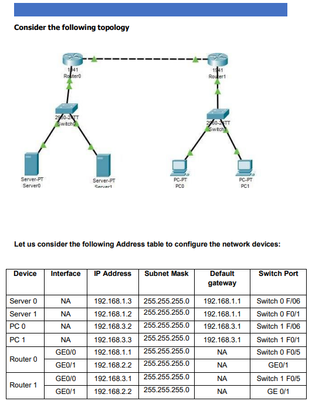
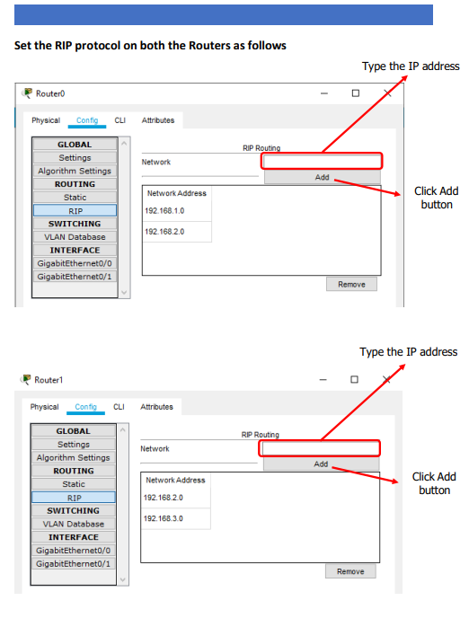
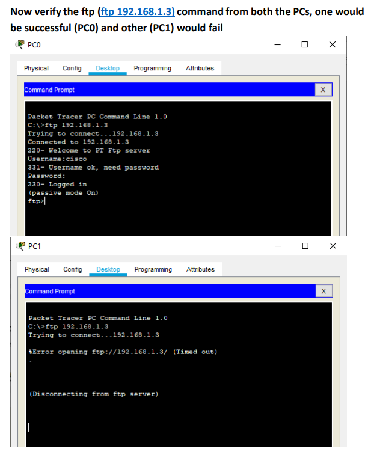
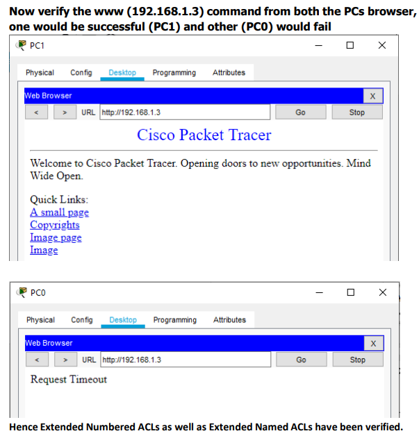

# Configuring Extended ACLs

## Part 1: Configure, Apply and Verify an Extended Numbered ACL
[Practical_File_1](ACLs_part_2.pkt)

1



---
2



---

### Type the following commands in the CLI mode of the Router1
```bash
Router#configure terminal
Router(config)#access-list 100 permit tcp host 192.168.3.2 host 192.168.1.3 eq ftp
Router(config)#interface GigabitEthernet0/1
Router(config-if)#ip access-group 100 out
Router(config-if)#exit
Router(config)#
```
Username:cisco
Password:cisco



## Part 2: Configure, Apply and Verify an Extended Named ACL
[Practical_File_2](ACLs_part_2.pkt)

We use the same topology for this case
Type the following command in the CLI mode of Router1
### Type the following commands in the CLI mode of the Router1
```bash
Router#configure terminal
Router(config)#ip access-list extended SMILE
Router(config-ext-nacl)#permit tcp host 192.168.3.3 host 192.168.1.3 eq www
Router(config-ext-nacl)#exit
Router(config)#
Router(config)#interface GigabitEthernet0/1
Router(config-if)#ip access-group SMILE out
Router(config-if)#exit
Router(config)#
```
In Web Browser URL `http://192.168.1.3`

