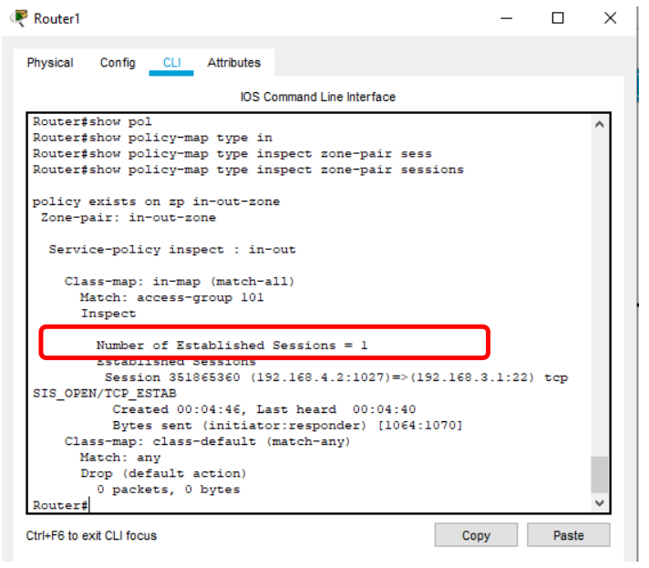

# Configuring a Zone-Based Policy Firewall
[Practical_File_All_In_One_from_part1_to_part5](Configuring%20a%20Zone-Based%20Policy%20Firewall_Final.pkt)

## PRACTICAL NO 5: Configuring a Zone-Based Policy Firewall (ZPF)
<!-- [Practical_File_1](Verify_connectivity_among_devices_before_firewall_configuration(Part_1).pkt) -->
1


## Part 1: Static Routing
[Practical_File_1](Firewall_part_1.pkt)
---

Static Routing is done using the following procedure for each Router
`Router 0`: Add the following in the Static mode of `Router0`

ADD the following `One-After-One`

`Network` Is `192.168.3.0`

`Mask` is `255.255.255.0`

`Next Hop` is `192.168.2.2`

Repeat

`Network` Is `192.168.4.0`

`Mask` is `255.255.255.0`

`Next Hop` is `192.168.2.2`


---

`Router 1`: Add the following in the Static mode of `Router1`

ADD the following `One-After-One`

`Network` Is `192.168.1.0`

`Mask` is `255.255.255.0`

`Next Hop` is `192.168.3.1`

Repeat

`Network` Is `192.168.2.0`

`Mask` is `255.255.255.0`

`Next Hop` is `192.168.3.1`


---
`Router 2`: Add the following in the Static mode of `Router2`

ADD the following `One-After-One`

`Network` Is `192.168.1.0`

`Mask` is `255.255.255.0`

`Next Hop` is `192.168.2.1`

Repeat

`Network` Is `192.168.4.0`

`Mask` is `255.255.255.0`

`Next Hop` is `192.168.3.2`


Now we check the connectivity by pinging the Server from the PC and from PC to
Server
---
`PC0`
CMD is `ping 192.168.1.2`

`Server0`
CMD is `ping 192.168.4.0`


## Part 2: Configuring SSH on Router 2
[Practical_File_2](Firewall_part_2.pkt)

Type the following commands in the `CLI mode` of `Router2`

```bash
Router>enable
Router#configure terminal
Router(config)#ip domain-name .com
Router(config)#hostname Router2
Router2(config)#crypto key generate rsa
Router2 (config)#line vty 0 4
Router2 (config-line)#transport input ssh
Router2 (config-line)#login local
Router2 (config-line)#exit
Router2 (config)#username ismail privilege 15 password cisco
```
Now verify ssh from `PC0` by typing the following command
`ssh -l ismail 192.168.3.1`

Password : `cisco`

Next we access the web services of the Server using the `web browser` of
`PC0` using the following

URL is `http://192.168.1.2` get The Result

## Part 3: Create the Firewall Zones on Router1
[Practical_File_3](Firewall_part_3.pkt)

Type the following commands in the `CLI mode` of `Router1`

```bash
Router1>enable
Router#show version
```

```bash
Router#configure terminal
Router (config)#license boot module c1900 technology-package securityk9
ACCEPT? [yes/no]: y
Router(config)#exit
Router>enable
Router#reload
Router>enable
Router#show version
```

```bash
Router#
Router#configure terminal
Router(config)#zone security in-zone
Router(config-sec-zone)#exit
Router(config)#zone security out-zone
Router(config-sec-zone)#exit
Router(config)#access-list 101 permit ip 192.168.4.0 0.0.0.255 any
Router(config)#class-map type inspect match-all in-map
Router(configcmap)#match access-group 101
Router(config-cmap)#exit
Router(config)#policy-map type inspect in-out
Router(config-pmap)#class type inspect in-map
Router(config-pmapc)#inspect
Router(config-pmap-c)#exit
Router(config-pmap)#exit
Router(config)#
Router(config)#zone-pair security in-out-zone source in-zone destination out-zone
Router(config-sec-zone-pair)#service-policy type inspect in-out
Router(config-sec-zone-pair)#exit
Router(config)#
Router(config)#interface GigabitEthernet0/0
Router(config-if)#zone-member security in-zone
Router(config-if)#exit
Router(config)#
Router(config)#interface Serial0/1/1
Router(config-if)#zone-member security out-zone
Router(config-if)#exit
Router(config)#exit
Router#copy running-config startup-config
```
## Part 4: Testing the Firewall Functionality (from in-zone to out-zone) by the following steps
[Practical_File_4](Firewall_part_4.pkt)

### Step 1: Pinging SERVER from PC (it will succeed)

In PC0 CMD is `ssh -l ismail 192.168.3.1`   Is Optional

Password is `cisco` 

`ping 192.168.1.2` Is Important 
---
### Step 2: Start an SSH session from PC to Router 2 (192.168.3.1)
In PC0 CMD is `ssh -l ismail 192.168.3.1`

Password is `cisco` 
### Step 3: Type the following command in the CLI mode of Router1
```bash
Router#show policy-map type inspect zone-pair sessions
```
We will get the following output:-


### Step 4: We close the SSH connection and open the web browser and access the server address (192.168.1.2) and get the following

In `PC0 Web Browser`

URL is `http://192.168.1.2` get The Result
## Part 5: Testing the Firewall Functionality (from out-zone to in-zone) by the following steps
[Practical_File_5](Configuring%20a%20Zone-Based%20Policy%20Firewall_Final.pkt)

### Step 1: Ping PC0 from the SERVER0 (ip 192.168.4.2) (`it will result in Failure`)

Hence the `Firewall` `functionality` `has` been `verified`
---