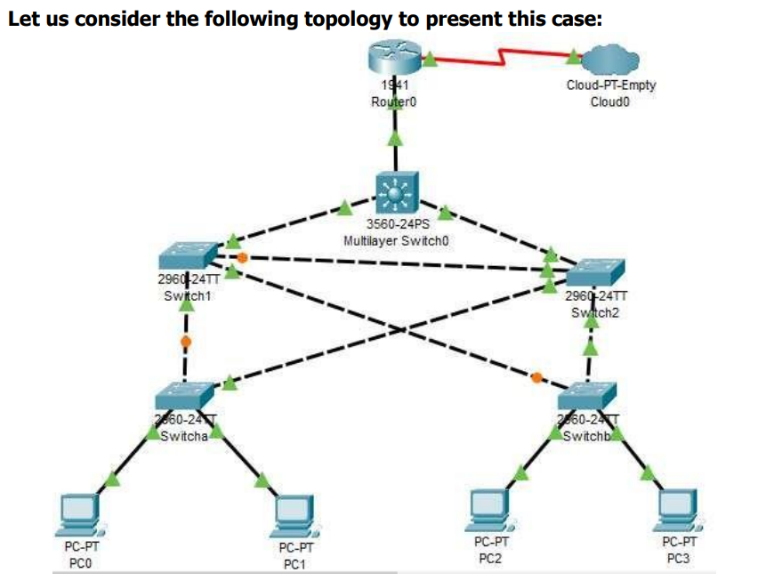

# Practical 7: Packet Tracer - Layer 2 Security Topology Objectives
[Practical_File_All_In_One_from_part1_to_part3](Layer_2_Security_Topology_Final.pkt)

1



## Part 1: Configure Root Bridge
[Practical_File_1](Configure%20Root%20Bridge_Part_1.pkt)
---

Type the following command in `CLI mode` of `Multilayer Switch0`, to check
which is the Root bridge

```bash
Switch>enable
Switch#show spanning-tree
```
The output shows that the bridge connected to GigabitEthernet 0/2 is the
Root Bridge, i.e., Switch 2 is the Root Bridge in the above topology.

Now we need to make Multilayer Switch0 as the Root Bridge. Type the
following commands in the `CLI mode` of `Multilayer Switch0`.
```bash
Switch#
Switch#configure terminal
Switch(config)#spanning-tree vlan 1 root primary
Switch(config)#do show spann
```
Now, we have made the `Multilayer Switch0` as the `Root Bridge`

But we also need to remove the Switch2 from Root Bridge. For that open
the `CLI mode` of `Switch2` and type the following code.
```bash
Switch2#configure terminal
Switch2(config)#spanning-tree vlan 1 root secondary
Switch2(config)#do show span
```

Thus, we have `successfully` made the central (Multilayer Switch0) as the
Root Bridge.

## Part 2: Protect Against STP Attacks
[Practical_File_2](Protect%20Against%20STP%20Attacks_Part_2.pkt)

Open `CLI mode` of `Switch a` and type the following command

```bash
Switcha>enable
Switcha#configure termial
Switcha(config)#interface range fastEthernet 0/1-2
Switcha(config-if-range)#switchport mode access
Switcha(config-if-range)#spanning-tree portfast
Switcha(config-if-range)#spanning-tree bpduguard enable
```
`Now minimize the Switch a window` and o`pen the Switch b CLI mode` and
type the same command

```bash
Switchb>enable
Switchb#configure termial
Switchb(config)#interface range fastEthernet 0/1-2
Switchb(config-if-range)#switchport mode access
Switchb(config-if-range)#spanning-tree portfast
Switchb(config-if-range)#spanning-tree bpduguard enable
```

`Now minimize the Switch b window` and `open the Switch 1 CLI mode` and
type the following command

```bash
Switch1>enable
Switch1#configure terminal
Switch1(config)#interface range fastEthernet 0/23-24
Switch1(config-if-range)#spanning-tree guard root
```

`Now minimize the Switch 1 window` and `open the Switch 2 CLI mode` and
type the same command

```bash
Switch2>enable
Switch2#configure terminal
Switch2(config)#interface range fastEthernet 0/23-24
Switch2(config-if-range)#spanning-tree guard root
```

Thus, we have Protected all the switch against STP Attacks.


## Part 3: Configure Port Security and Disable unsed ports
[Practical_File_2](Layer_2_Security_Topology_Final.pkt)

Open `CLI mode of Switch a` and type the following command

```bash
Switcha(config-if-range)#switchport port-security
Switcha(config-if-range)#switchport port-security maximum 2
Switcha(config-if-range)#switchport port-security mac-address sticky
Switcha(config-if-range)#switchport port-security violation shutdown
```

`Now minimize the Switch a window` and `open the Switch b CLI mode` and
type the same command
```bash
Switchb(config-if-range)#switchport port-security
Switchb(config-if-range)#switchport port-security maximum 2
Switchb(config-if-range)#switchport port-security mac-address sticky
Switchb(config-if-range)#switchport port-security violation shutdown
```

Now let us check if the security is enabled or not. `Open CLI mode of Switch
a` and type the following

```bash
Switcha(config-if-range)# CTRL Z
Switcha#show port-security interface f0/1
```

Let us now `disable all the unused ports in switch a and switch b`. 

Open the `CLI mode of Switch a` and type the following command

```bash
Switcha#enable
Switcha#configure terminal
Switcha(config)#interface range fastEthernet 0/3-22
Switcha(config-if-range)#shutdown
```
Open the `CLI mode of Switch b` and type the following command

```bash
Switchb#enable
Switchb#configure terminal
Switchb(config)#interface range fastEthernet 0/3-22
Switchb(config-if-range)#shutdown
```
Thus, Port Security is enabled and all the unsed ports are disabled.
---